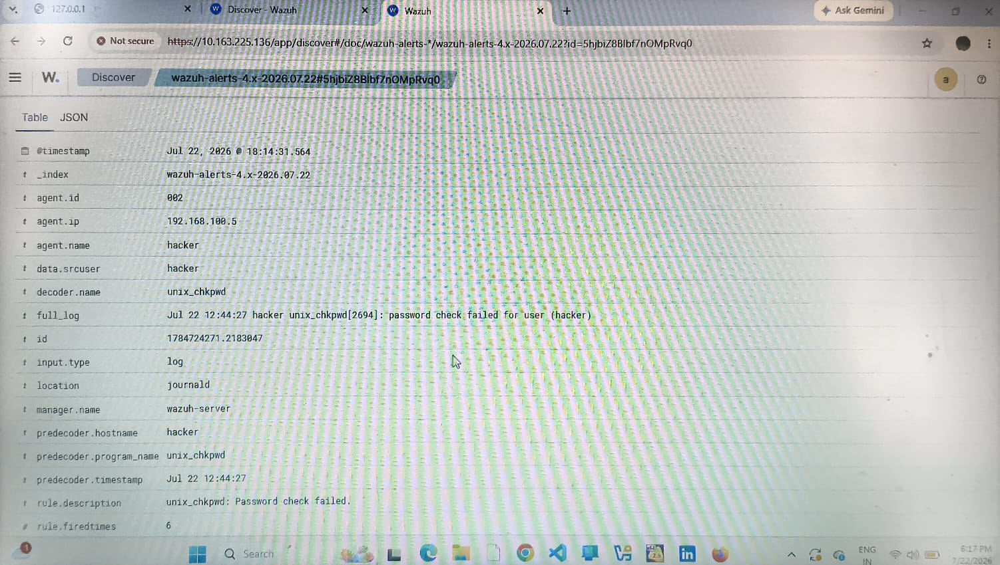
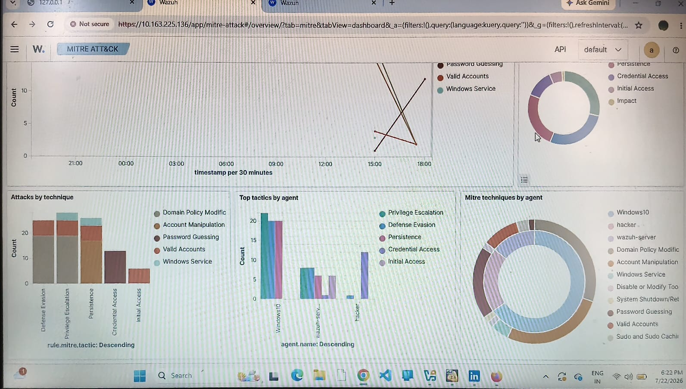
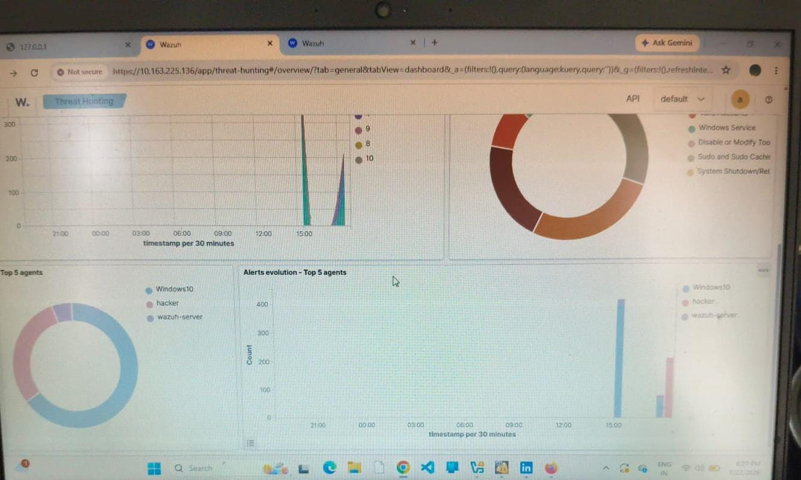

# 🛡️ SOC Detection Lab – Wazuh SIEM Deployment & Threat Monitoring

Hands-on SOC Home Lab focused on **security monitoring, threat detection, log analysis, authentication failure detection, MITRE ATT&CK mapping, and threat hunting** using Wazuh.

---

## 📌 Project Overview

This project demonstrates the deployment of a **Wazuh SIEM home lab** on an Acer PC and Windows environment for centralized endpoint monitoring and security event analysis.

The lab was implemented to monitor endpoint logs, detect authentication failures, analyze security events, and map detected activities to the **MITRE ATT&CK Framework** through the Wazuh Dashboard.

### 🎯 Key Objectives

* Centralized endpoint log monitoring
* Authentication failure detection
* Security event analysis
* MITRE ATT&CK mapping
* Threat hunting and dashboard analysis
* Investigation of endpoint security events

---

# 🏗️ Lab Architecture

The following architecture represents the flow of endpoint logs from monitored systems to the Wazuh Manager and Dashboard.


# 🖥️ Environment Setup

| Component        | Details         |
| ---------------- | --------------- |
| SIEM             | Wazuh           |
| Wazuh Version    | 4.14.6          |
| Host Machine     | PC              |
| Wazuh Manager    | 10.x.x.x        |
| Linux Endpoint   | 192.x.x.x       |
| Windows Endpoint | Windows 10      |
| Linux Agent      | Wazuh Agent     |
| Monitoring       | Wazuh Dashboard |
| Threat Framework | MITRE ATT&CK    |

---

# ⚙️ Wazuh Linux Agent Installation

The Wazuh agent was installed on the Linux endpoint and configured to communicate with the central Wazuh Manager.

## 1. Install Wazuh Agent

```bash
sudo WAZUH_MANAGER="10.x.x.x" dpkg -i wazuh-agent_4.14.6-1_amd64.deb
```

## 2. Reload System Services

```bash
sudo systemctl daemon-reload
```

## 3. Enable Wazuh Agent

```bash
sudo systemctl enable wazuh-agent
```

## 4. Start Wazuh Agent

```bash
sudo systemctl start wazuh-agent
```

The agent was successfully installed and started, enabling communication with the central Wazuh Manager.

---

# 🔍 Detection & Monitoring Workflow

```text
Endpoint Activity
       │
       ▼
Operating System Logs
       │
       ▼
Wazuh Agent
       │
       ▼
Wazuh Manager
       │
       ▼
Log Parsing & Detection
       │
       ▼
Security Alert
       │
       ▼
MITRE ATT&CK Mapping
       │
       ▼
Wazuh Dashboard
       │
       ▼
Threat Hunting & Analysis
```

---

# 📸 Lab Screenshots & Evidence

## 1️⃣ Linux Agent Installation & Status

The Wazuh agent was successfully installed and its running status was verified on the Linux Acer PC.

The screenshot demonstrates the active Wazuh agent service and its communication with the central Wazuh Manager.

### Evidence


---

## 🚨 2️⃣ Wazuh Discover – Authentication Failure Logs

Wazuh Discover was used to analyze authentication-related system logs.

The captured **PAM** and **unix_chkpwd** logs show explicit failed password attempts.

### Detection Details

| Parameter      | Value                  |
| -------------- | ---------------------- |
| Rule ID        | 5557                   |
| Severity Level | 5                      |
| Log Sources    | PAM / unix_chkpwd      |
| Event Type     | Authentication Failure |

These logs demonstrate how raw operating system events are collected and analyzed as structured security events within Wazuh.

### Evidence



---

## 🎯 3️⃣ MITRE ATT&CK Dashboard Analysis

The Wazuh Dashboard provides MITRE ATT&CK mapping for detected security events.

The authentication-related activity observed in this lab was categorized under:

| MITRE Attribute | Details           |
| --------------- | ----------------- |
| Tactic          | Credential Access |
| Technique       | T1110.001         |
| Technique Name  | Password Guessing |

This demonstrates the use of MITRE ATT&CK to provide context to detected security events.

### Evidence




---

## 📊 4️⃣ Threat Hunting Summary & Analytics

The Wazuh Dashboard was used to review overall security monitoring information, including:

* Total alert metrics
* Agent distribution
* Authentication failure frequency
* Security event activity
* Overall endpoint security monitoring

This dashboard provides a centralized view for analyzing security events and monitoring endpoint security posture.

### Evidence




---

# 🧩 MITRE ATT&CK Mapping

The detected authentication-related activity was mapped to the following MITRE ATT&CK technique:

| Tactic            | Technique         | ID        | Activity                                  |
| ----------------- | ----------------- | --------- | ----------------------------------------- |
| Credential Access | Password Guessing | T1110.001 | Failed authentication / password attempts |

---

# 🔎 Key Findings

The lab successfully demonstrated:

* Successful deployment of the Wazuh SIEM environment.
* Successful installation and activation of the Linux Wazuh agent.
* Centralized collection and analysis of endpoint logs.
* Detection of authentication failures through PAM and unix_chkpwd logs.
* Identification of Wazuh Rule ID **5557** with Severity Level **5**.
* Mapping of authentication-related activity to MITRE ATT&CK **T1110.001 – Password Guessing**.
* Use of the Wazuh Dashboard for security monitoring and threat hunting analysis.

---

# 🛠️ Technologies Used

* Wazuh SIEM
* Linux
* Windows 10
* Wazuh Agent
* Wazuh Manager
* Wazuh Dashboard
* MITRE ATT&CK
* PAM
* unix_chkpwd

---


---

# 📌 Conclusion

This hands-on SOC home lab successfully demonstrates **endpoint log collection, SIEM monitoring, security event detection, MITRE ATT&CK mapping, threat hunting, and incident investigation workflows** using Wazuh.

The project provides practical experience in centralized security monitoring and analysis of authentication-related security events through a Wazuh-based SOC environment.
